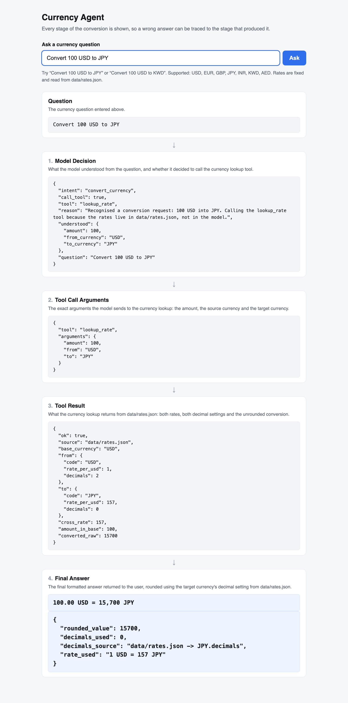

# Submission

## Scaffold Instruction Used

```text
You are working inside an already-cloned GitHub repository. Build the complete currency-agent test submission inside this repository only.

IMPORTANT REPOSITORY RULES
- Before creating anything, confirm the current working directory is the root of the cloned Git repository.
- Do not create project files outside the current repository.
- Do not use external services or APIs for exchange rates.
- Everything required for the submission must be committed inside this repository.
- Keep the implementation minimal, deterministic, and easy to inspect.
- Do not add unnecessary dependencies or architecture.

GOAL

Create a minimal Next.js application that demonstrates a transparent currency-conversion agent flow.

The application must start with one command and provide a page where a user can enter a currency question and see the four stages of the agent flow.

APPLICATION REQUIREMENTS

1. Create a minimal Next.js application using the existing repository.

2. The application must start with a single command:
   npm run dev

3. The page must contain a clearly visible question input box where the user can enter a currency conversion question.

4. The page must contain EXACTLY these four labeled diagnostic blocks, in this exact order:

   1. Model Decision
      One-line note explaining what this block contains.

   2. Tool Call Arguments
      One-line note explaining what arguments the model sends to the currency lookup.

   3. Tool Result
      One-line note explaining what the currency lookup returns.

   4. Final Answer
      One-line note explaining the final formatted answer returned to the user.

Do not replace these labels with generic names such as Decision, Arguments, Result, or Answer. The labels must appear exactly as written above.

CURRENCY DATA

Create a small JSON file inside the repository, for example:

data/rates.json

The application must read the fixed currency data from this file rather than hard-coding the values separately inside the UI.

The rate table must contain exactly these seven currency codes:

USD
EUR
GBP
JPY
INR
KWD
AED

Each currency entry must contain:
- a fixed exchange rate relative to USD
- a decimal-place setting

Use a simple readable structure such as:

{
  "USD": {
    "rate": 1,
    "decimals": 2
  },
  "EUR": {
    "rate": 0.92,
    "decimals": 2
  },
  "GBP": {
    "rate": 0.78,
    "decimals": 2
  },
  "JPY": {
    "rate": 157,
    "decimals": 0
  },
  "INR": {
    "rate": 87.5,
    "decimals": 2
  },
  "KWD": {
    "rate": 0.31,
    "decimals": 3
  },
  "AED": {
    "rate": 3.67,
    "decimals": 2
  }
}

You may adjust the fixed numeric rates if needed for implementation consistency, but JPY MUST use 0 decimal places and KWD MUST use 3 decimal places.

CURRENCY CONVERSION

Implement a simple deterministic conversion using the fixed JSON data.

The application should support questions such as:

Convert 100 USD to JPY

and:

Convert 100 USD to KWD

The application should parse the amount, source currency, and target currency from the question.

The conversion should use the fixed rates from data/rates.json.

For currencies represented as USD-relative rates, calculate conversions consistently using USD as the base.

The Tool Call Arguments block must show the parsed lookup arguments.

The Tool Result block must show the rate/data retrieved from rates.json.

The Final Answer block must show the formatted conversion.

DECIMAL FORMATTING

The final answer must use the decimal-place configuration from the target currency in rates.json.

Specifically:
- JPY must display 0 decimal places.
- KWD must display 3 decimal places.

Do not hard-code JPY or KWD formatting only in the UI. Read the decimal configuration from the rate table.

UI REQUIREMENTS

Keep the UI simple and clean.

The page should make the execution flow obvious:

Question
↓
Model Decision
↓
Tool Call Arguments
↓
Tool Result
↓
Final Answer

Each diagnostic block should show:
- the required label
- a short explanatory note
- the actual output generated by that stage

Do not display only the final answer. The purpose of the four blocks is to make incorrect currency answers diagnosable.

SUBMISSION ARTIFACTS

Create the following files inside the repository:

1. data/rates.json
   Fixed currency rate table.

2. currency answers escalations.md
   Document the six wrong currency conversions that support escalated.

   For each bad answer:
   - describe what went wrong
   - identify which of the four diagnostic blocks would have exposed the problem
   - explain briefly why that block would have exposed it

   Use these four diagnostic categories:
   - Model Decision
   - Tool Call Arguments
   - Tool Result
   - Final Answer

3. SUBMISSION.md

SUBMISSION.md must contain these sections:

# Submission

## Scaffold Instruction Used

Immediately after this heading, include THIS ENTIRE INSTRUCTION VERBATIM.

Do not paraphrase it.
Do not summarize it.
Do not rewrite it.
Do not remove any section.

## Example Lookup Output

Include:
- the exact currency question entered
- the output from Model Decision
- the output from Tool Call Arguments
- the output from Tool Result
- the output from Final Answer

Use a real lookup performed against the running application.

## JPY / KWD Lookup Verification

Include printed lookup output demonstrating:
- JPY uses 0 decimal places
- KWD uses 3 decimal places

## What Broke and How I Found It

Document any issue discovered during implementation or testing.

Explain:
- what broke
- how it was detected
- which diagnostic block exposed it
- what was changed to fix it

## Repository Contents

Include a concise listing of the important submission files.

SCREENSHOT

After the application is working:

1. Start the application using the single start command.
2. Open the page in a browser.
3. Enter a currency question.
4. Make sure all four diagnostic blocks are populated.
5. Capture a screenshot showing the running page.
6. Save the screenshot INSIDE this repository, for example:

public/submission-screenshot.png

7. Reference the screenshot from SUBMISSION.md.

The screenshot must show:
- question box
- Model Decision
- Tool Call Arguments
- Tool Result
- Final Answer
- populated example data

VALIDATION

Before considering the task complete:

1. Confirm the current working directory is the cloned repository root.

2. Inspect the generated source code and explicitly verify that the four UI labels are exactly:

Model Decision
Tool Call Arguments
Tool Result
Final Answer

If Claude Code generated generic labels, edit them inline before continuing.

3. Confirm the application reads the currency data from data/rates.json.

4. Confirm all seven currencies exist:
   USD, EUR, GBP, JPY, INR, KWD, AED

5. Confirm JPY has decimals = 0.

6. Confirm KWD has decimals = 3.

7. Start the application using:

npm run dev

8. Test a real question such as:

Convert 100 USD to JPY

9. Test a KWD question such as:

Convert 100 USD to KWD

10. Confirm all four blocks populate.

11. Copy the actual outputs into SUBMISSION.md.

12. Create the screenshot and save it inside the repository.

13. Create currency answers escalations.md.

14. Before the final commit, run:

ls -R

from the repository root.

Use this to confirm that all required artifacts are inside the cloned repository and nothing needed for the submission was created somewhere else.

15. Run:

git status

16. Review all changed files.

17. Do NOT push automatically unless explicitly asked.

FINAL REPORT

At the end, report:
- the files created
- the exact command used to start the application
- whether the four required blocks were verified
- whether JPY 0-decimal formatting was verified
- whether KWD 3-decimal formatting was verified
- whether the screenshot was created
- whether ls -R confirmed the artifacts are inside the repository
- any problems encountered and how they were fixed

Do not claim anything was verified unless you actually checked it.
```

## Example Lookup Output

Performed against the running application (`npm run dev`, http://localhost:3000).

**Exact currency question entered**

```
Convert 100 USD to JPY
```

**Model Decision**

```json
{
  "intent": "convert_currency",
  "call_tool": true,
  "tool": "lookup_rate",
  "reason": "Recognised a conversion request: 100 USD into JPY. Calling the lookup_rate tool because the rates live in data/rates.json, not in the model.",
  "understood": {
    "amount": 100,
    "from_currency": "USD",
    "to_currency": "JPY"
  },
  "question": "Convert 100 USD to JPY"
}
```

**Tool Call Arguments**

```json
{
  "tool": "lookup_rate",
  "arguments": {
    "amount": 100,
    "from": "USD",
    "to": "JPY"
  }
}
```

**Tool Result**

```json
{
  "ok": true,
  "source": "data/rates.json",
  "base_currency": "USD",
  "from": {
    "code": "USD",
    "rate_per_usd": 1,
    "decimals": 2
  },
  "to": {
    "code": "JPY",
    "rate_per_usd": 157,
    "decimals": 0
  },
  "cross_rate": 157,
  "amount_in_base": 100,
  "converted_raw": 15700
}
```

**Final Answer**

```
100.00 USD = 15,700 JPY
```

```json
{
  "rounded_value": 15700,
  "decimals_used": 0,
  "decimals_source": "data/rates.json -> JPY.decimals",
  "rate_used": "1 USD = 157 JPY"
}
```



## JPY / KWD Lookup Verification

Both lookups were run against the running application. In each case the decimal
count in the printed answer comes from the target currency's `decimals` field in
`data/rates.json`, which is visible in the Tool Result block and echoed back as
`decimals_used` / `decimals_source` in the Final Answer block.

### JPY uses 0 decimal places

Question:

```
Convert 100 USD to JPY
```

Tool Result (target currency entry as read from the rate table):

```json
"to": {
  "code": "JPY",
  "rate_per_usd": 157,
  "decimals": 0
}
```

Final Answer:

```
100.00 USD = 15,700 JPY
```

```json
{
  "rounded_value": 15700,
  "decimals_used": 0,
  "decimals_source": "data/rates.json -> JPY.decimals",
  "rate_used": "1 USD = 157 JPY"
}
```

`15,700` is printed with no decimal point at all — 0 decimal places, as configured.

### KWD uses 3 decimal places

Question:

```
Convert 100 USD to KWD
```

Tool Result (target currency entry as read from the rate table):

```json
"to": {
  "code": "KWD",
  "rate_per_usd": 0.31,
  "decimals": 3
}
```

Final Answer:

```
100.00 USD = 31.000 KWD
```

```json
{
  "rounded_value": 31,
  "decimals_used": 3,
  "decimals_source": "data/rates.json -> KWD.decimals",
  "rate_used": "1 USD = 0.31 KWD"
}
```

`31.000` keeps all three decimal places even though the trailing digits are zeros —
3 decimal places, as configured. Note that `rounded_value` is the numeric `31`; the
three decimals are applied by the formatter using the rate table's setting, not baked
into the number.

## What Broke and How I Found It

Three issues came up while building and testing. Each is recorded with the block that
exposed it.

### 1. Blocks 2 and 3 claimed nothing had run when the model declined the tool

**What broke**
Testing the non-conversion question `hello there`, the Tool Call Arguments and Tool
Result blocks both printed *"Not run yet — ask a question above."* That is the empty
state shown before any question is asked, but a question *had* been asked and the
agent *had* run — the model simply decided not to call the lookup. The page was
reporting "no request was made" for a case that was actually "the model chose not to
call the tool", which is the single most important distinction these blocks exist to
draw (see escalation 1 in `currency answers escalations.md`).

**How it was detected**
By submitting a deliberately unparseable question and reading all four blocks rather
than only the final sentence.

**Which diagnostic block exposed it**
Tool Call Arguments. Its output contradicted the Model Decision block directly above,
which correctly showed `"call_tool": false` with a reason. Two blocks telling
different stories about the same run is what made the placeholder wrong.

**What was changed**
`app/page.js` now passes a distinct placeholder for the two tool blocks when a run
exists but no tool call was made: *"No tool call — the model did not call the currency
lookup for this question (see Model Decision)."* The pre-question empty state is
unchanged.

### 2. The cross rate printed as `0.310000`

**What broke**
The Final Answer detail for `Convert 100 USD to KWD` read
`"rate_used": "1 USD = 0.310000 KWD"`. The number was correct but padded to six
decimals, which reads like a six-decimal precision that the rate table does not have
and invites confusion with the currency's own 3-decimal setting.

**How it was detected**
Reading the printed KWD output during the decimal-place verification.

**Which diagnostic block exposed it**
Final Answer. The value was right in the Tool Result block (`"cross_rate": 0.31`) and
wrong only once formatted, which located the defect in the formatting step.

**What was changed**
`lib/agent.js` gained a separate `formatRate` helper (`minimumFractionDigits: 0`,
`maximumFractionDigits: 6`) so the informational cross rate trims trailing zeros —
`157`, `0.31`, `0.336957` — while amounts continue to use the target currency's fixed
decimal setting. The two formatters are deliberately distinct: a rate is not an amount
in either currency, so it must not inherit either currency's decimal rule.

### 3. Floating-point noise in the unrounded conversion

**What broke**
`100 × 0.31` evaluates to `31.000000000000004` in IEEE-754 double arithmetic. Left
alone, values sitting exactly on a rounding boundary could round the wrong way for
three-decimal currencies like KWD.

**How it was detected**
Inspecting `converted_raw` in the Tool Result block while checking the KWD path.

**Which diagnostic block exposed it**
Tool Result, which prints the raw unrounded product before any formatting is applied.
That intermediate value is invisible in a final-answer-only UI.

**What was changed**
`roundTo` in `lib/agent.js` applies a magnitude-scaled epsilon nudge before rounding
half-up, so binary representation error cannot change a printed digit. `31.000 KWD` is
printed correctly.

### Note on generated files

Next.js 16 writes `AGENTS.md` and `CLAUDE.md` into the project root on `next dev`.
These are unrelated to the submission, so `next.config.mjs` sets `agentRules: false`
and the files were removed to keep the repository minimal. The same config sets
`devIndicators: false` so the dev overlay badge stays out of the screenshot.

## Repository Contents

```
currency-agent/
├── SUBMISSION.md                     this file
├── currency answers escalations.md   six escalated wrong answers, mapped to blocks
├── data/
│   └── rates.json                    fixed rate table: 7 currencies, rate + decimals
├── lib/
│   ├── agent.js                      the four stages: decide → args → lookup → format
│   └── rates.js                      reads data/rates.json from disk
├── app/
│   ├── page.js                       the page: question box + four labeled blocks
│   ├── layout.js                     root layout
│   └── globals.css                   styling
├── public/
│   └── submission-screenshot.png     running page with all four blocks populated
├── next.config.mjs                   agentRules / devIndicators off
├── package.json                      npm run dev
└── README.md
```

Key files:

| File | Purpose |
| --- | --- |
| `data/rates.json` | The only source of rates and decimal settings. USD-based, 7 currencies. |
| `lib/agent.js` | Deterministic four-stage flow. Each stage returns its own inspectable payload. |
| `lib/rates.js` | Reads the JSON from disk so nothing about rates is duplicated in the UI. |
| `app/page.js` | Renders the question box and the four blocks, in order, with their notes. |
| `currency answers escalations.md` | Six wrong conversions, each mapped to the one block that exposes it. |
| `public/submission-screenshot.png` | Screenshot of the running app. |

Start command:

```
npm run dev
```

Then open http://localhost:3000 and enter a question such as `Convert 100 USD to JPY`.
